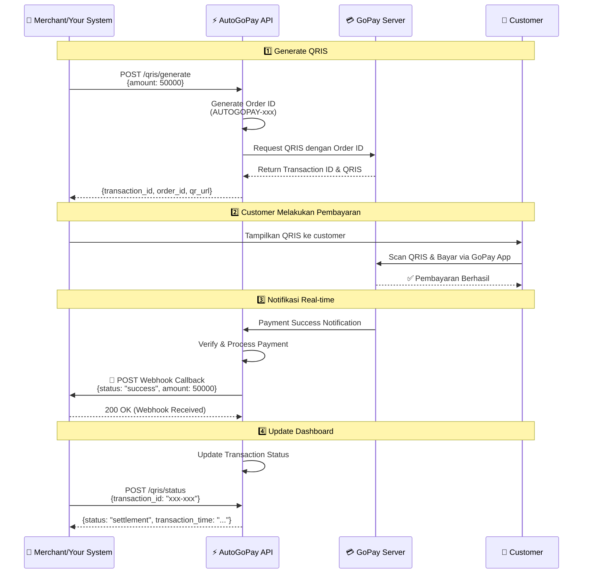
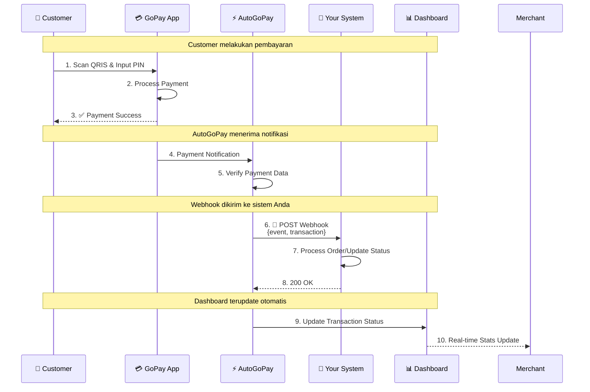

# AutoGoPay - Platform Otomasi Pembayaran GoPay QRIS

<div align="center">


**Platform otomasi pembayaran QRIS dengan API yang powerful untuk merchant Indonesia**

[](https://gopay.sawargipay.cloud)
[](https://t.me/AutoGopayBot)
[]()
[]()

</div>

---

## Tentang AutoGoPay

AutoGoPay adalah platform yang memudahkan merchant untuk menerima pembayaran GoPay secara otomatis melalui QRIS. Dengan AutoGoPay, Anda dapat:

- Generate QRIS dinamis dengan amount
- Cek status transaksi secara real-time
- Terima notifikasi otomatis via webhook
- Monitor semua transaksi di dashboard
- Integrasi mudah dengan sistem Anda

---

## Fitur Utama

### Generate QRIS Otomatis
Buat QRIS dinamis dengan nominal custom untuk setiap transaksi. Setiap QRIS memiliki Transaction ID unik untuk tracking yang akurat.

### Cek Status Real-time
Pantau status pembayaran secara real-time menggunakan Transaction ID. Tidak perlu khawatir dengan transaksi yang memiliki nominal sama.

### Webhook Callback
Terima notifikasi otomatis ke sistem Anda saat transaksi berhasil. Webhook dikirim secara real-time untuk update status pembayaran.

### Dashboard Monitoring
Dashboard intuitif untuk monitoring semua transaksi, statistik pendapatan, dan performa bisnis Anda.

### Keamanan & Keandalan
Data terenkripsi dengan standar industri. Kami tidak menyimpan informasi sensitif seperti password GoPay Anda.

---

## Cara Kerja

### Diagram Alur Sistem



### Alur Transaksi Step-by-Step

#### 1️⃣ Generate QRIS
Sistem Anda request QRIS dengan nominal tertentu melalui API. AutoGoPay akan generate Order ID otomatis dan request QRIS ke GoPay, kemudian return Transaction ID dari GoPay.

**Request:**
```bash
POST /qris/generate
{
  "amount": 50000
}
```

**Response:**
```json
{
  "success": true,
  "message": "QRIS created successfully",
  "data": {
    "transaction_id": "b3d4c5e6-f7g8-h9i0-j1k2-l3m4n5o6p7q8",
    "order_id": "AUTOGOPAY-1234567890-5678",
    "amount": 50000,
    "transaction_status": "pending",
    "qr_string": "00020101021126...",
    "qr_url": "https://api.midtrans.com/qr/...",
    "transaction_time": "2024-03-30 10:15:00",
    "expiry_time": "2024-03-30 10:30:00"
  }
}
```

**Penjelasan:**
- `order_id` - Auto-generated oleh AutoGoPay (format: AUTOGOPAY-xxx)
- `transaction_id` - Dari GoPay/Midtrans, gunakan ini untuk cek status
- `qr_url` - URL gambar QRIS untuk ditampilkan ke customer
- `qr_string` - String QRIS untuk generate QR code sendiri
- `expiry_time` - QRIS berlaku 15 menit

#### 2️⃣ Customer Bayar
Customer scan QRIS yang ditampilkan dan melakukan pembayaran melalui aplikasi GoPay.

#### 3️⃣ Webhook Callback (Real-time)
Setelah pembayaran berhasil, AutoGoPay langsung kirim webhook ke sistem Anda secara real-time.

**Webhook Payload:**
```json
{
  "event": "transaction.received",
  "timestamp": "2024-03-30 10:30:00",
  "transaction": {
    "transaction_id": "b3d4c5e6-f7g8-h9i0-j1k2-l3m4n5o6p7q8",
    "order_id": "AUTOGOPAY-1234567890-5678",
    "amount": 50000,
    "status": "PAID",
    "payment_method": "QRIS",
    "paid_at": "2024-03-30T10:30:00Z",
    "settlement_time": "2024-03-30T10:30:05Z"
  }
}
```

#### 4️⃣ Cek Status (Optional)
Anda juga bisa cek status transaksi kapan saja menggunakan Transaction ID dari GoPay.

**Request:**
```bash
POST /qris/status
{
  "transaction_id": "b3d4c5e6-f7g8-h9i0-j1k2-l3m4n5o6p7q8"
}
```

**Response:**
```json
{
  "success": true,
  "message": "Transaction successful",
  "data": {
    "transaction_id": "b3d4c5e6-f7g8-h9i0-j1k2-l3m4n5o6p7q8",
    "transaction_status": "settlement",
    "transaction_time": "2024-03-30 10:30:00"
  }
}
```

**Status yang mungkin:**
- `pending` - Menunggu pembayaran
- `settlement` - Pembayaran berhasil
- `expire` - QRIS sudah expired
- `cancel` - Transaksi dibatalkan

---

## Cara Memulai

### 📋 Langkah-langkah Setup (5 Menit)

#### 1️⃣ Registrasi Akun (Gratis)

Daftar akun gratis di [gopay.sawargipay.cloud/register](https://gopay.sawargipay.cloud/register)

**Yang Anda Butuhkan:**
- ✉️ Email aktif
- 📱 Telegram ID untuk notifikasi
- 🔐 Password yang kuat

#### 2️⃣ Beli Activation Key

Hubungi bot Telegram [@AutoGopayBot](https://t.me/AutoGopayBot) untuk membeli Activation Key

**Paket Tersedia:**
- **1 Hari** - Rp 1.000 (Testing & Trial)
- **Custom** - Sesuai kebutuhan Anda

💡 **Tips:** Mulai dengan paket 1 hari untuk testing terlebih dahulu!

#### 3️⃣ Aktivasi Akun

1. Login ke [dashboard](https://gopay.sawargipay.cloud/login)
2. Masukkan **Activation Key** yang sudah dibeli
3. Klik **Activate** - Akun langsung aktif!

#### 4️⃣ Hubungkan GoPay Merchant

**Proses Mudah & Aman:**

1. Klik tombol **"Connect GoPay"** di dashboard
2. Masukkan **nomor HP** akun GoPay merchant Anda
3. Verifikasi **OTP** yang dikirim ke HP
4. ✅ **Selesai!** GoPay terhubung

⚠️ **Catatan Keamanan:** 
- Kami tidak menyimpan password GoPay Anda
- Koneksi langsung ke server GoPay dengan enkripsi
- Token akses disimpan dengan enkripsi AES-256

#### 5️⃣ Mulai Terima Pembayaran

**Opsi 1: Gunakan Dashboard**
- Generate QRIS langsung dari dashboard
- Monitor transaksi real-time
- Download laporan transaksi

**Opsi 2: Integrasi API**
- Dokumentasi lengkap tersedia di dashboard
- Copy API Key dari menu Settings
- Mulai integrasi dengan sistem Anda

---

## 🚀 Quick Start - API Integration

### Setup API Key

```bash
# Ambil API Key dari dashboard Settings
API_KEY="your-api-key-here"
```

### Generate QRIS

```bash
curl -X POST https://gopay.sawargipay.cloud/api/qris/generate \
  -H "X-API-Key: $API_KEY" \
  -H "Content-Type: application/json" \
  -d '{
    "amount": 50000
  }'
```

**Response:**
```json
{
  "success": true,
  "message": "QRIS created successfully",
  "data": {
    "transaction_id": "b3d4c5e6-f7g8-h9i0-j1k2-l3m4n5o6p7q8",
    "order_id": "AUTOGOPAY-1234567890-5678",
    "amount": 50000,
    "transaction_status": "pending",
    "qr_string": "00020101021126...",
    "qr_url": "https://api.midtrans.com/qr/...",
    "transaction_time": "2024-03-30 10:15:00",
    "expiry_time": "2024-03-30 10:30:00"
  }
}
```

**Penting:**
- Simpan `transaction_id` untuk cek status pembayaran
- Tampilkan `qr_url` atau generate QR dari `qr_string` ke customer
- QRIS berlaku 15 menit (lihat `expiry_time`)

### Cek Status Transaksi

```bash
curl -X POST https://gopay.sawargipay.cloud/api/qris/status \
  -H "X-API-Key: $API_KEY" \
  -H "Content-Type: application/json" \
  -d '{
    "transaction_id": "b3d4c5e6-f7g8-h9i0-j1k2-l3m4n5o6p7q8"
  }'
```

**Response:**
```json
{
  "success": true,
  "message": "Transaction successful",
  "data": {
    "transaction_id": "b3d4c5e6-f7g8-h9i0-j1k2-l3m4n5o6p7q8",
    "transaction_status": "settlement",
    "transaction_time": "2024-03-30 10:30:00"
  }
}
```

### Setup Webhook URL

```bash
curl -X POST https://gopay.sawargipay.cloud/api/user/callback-url \
  -H "X-API-Key: $API_KEY" \
  -H "Content-Type: application/json" \
  -d '{
    "callback_url": "https://yourdomain.com/webhook/gopay"
  }'
```

---

## Webhook Callback

AutoGoPay mengirim webhook callback ke URL yang Anda daftarkan saat transaksi berhasil.

### 🔔 Diagram Webhook Flow



### 📦 Format Webhook Payload

```json
{
  "event": "transaction.received",
  "timestamp": "2024-03-30 10:30:00",
  "transaction": {
    "transaction_id": "b3d4c5e6-f7g8-h9i0-j1k2-l3m4n5o6p7q8",
    "order_id": "AUTOGOPAY-1234567890-5678",
    "amount": 50000,
    "status": "PAID",
    "payment_method": "QRIS",
    "paid_at": "2024-03-30T10:30:00Z",
    "settlement_time": "2024-03-30T10:30:05Z"
  }
}
```

**Field Description:**
- `event` - Event type (always "transaction.received")
- `timestamp` - Waktu webhook dikirim (WIB)
- `transaction.transaction_id` - Transaction ID dari GoPay (gunakan untuk cek status)
- `transaction.order_id` - Order ID yang auto-generated (format: AUTOGOPAY-xxx)
- `transaction.amount` - Nominal pembayaran (dalam Rupiah)
- `transaction.status` - Status transaksi (PAID/PENDING)
- `transaction.payment_method` - Metode pembayaran (QRIS)
- `transaction.paid_at` - Waktu pembayaran berhasil
- `transaction.settlement_time` - Waktu settlement (optional)

**Headers:**
- `X-Signature` - HMAC-SHA256 signature untuk verifikasi
- `X-Callback-Event` - Event type (transaction.received)
- `X-Retry-Attempt` - Nomor retry attempt (1-3)

### 🔐 Verifikasi Webhook Signature

Setiap webhook dilengkapi HMAC signature untuk keamanan. Gunakan **API Key** Anda sebagai secret untuk verifikasi:

```javascript
// Node.js Example
const crypto = require('crypto');

function verifyWebhook(payload, signature, apiKey) {
  const hmac = crypto.createHmac('sha256', apiKey);
  hmac.update(payload); // payload as string
  const expectedSignature = hmac.digest('hex');
  
  return signature === expectedSignature;
}

// Usage
app.post('/webhook/gopay', (req, res) => {
  const signature = req.headers['x-signature'];
  const payload = JSON.stringify(req.body);
  
  if (!verifyWebhook(payload, signature, YOUR_API_KEY)) {
    return res.status(401).json({ error: 'Invalid signature' });
  }
  
  // Process webhook...
});
```

```php
// PHP Example
function verifyWebhook($payload, $signature, $apiKey) {
    $expectedSignature = hash_hmac('sha256', $payload, $apiKey);
    return hash_equals($signature, $expectedSignature);
}

// Usage
$payload = file_get_contents('php://input');
$signature = $_SERVER['HTTP_X_SIGNATURE'];

if (!verifyWebhook($payload, $signature, $yourApiKey)) {
    http_response_code(401);
    exit('Invalid signature');
}
```

### Setup Webhook di Dashboard

**Langkah-langkah:**

1. 🔑 Login ke [dashboard](https://gopay.sawargipay.cloud/login)
2. ⚙️ Buka menu **Settings**
3. 🌐 Masukkan **Webhook URL** Anda (contoh: `https://yourdomain.com/webhook/gopay`)
4. 💾 Klik **Save**
5. 🧪 Test webhook dengan tombol **Test Webhook**

**Contoh Implementasi Webhook Handler:**

```javascript
// Express.js Example
app.post('/webhook/gopay', (req, res) => {
  const { event, timestamp, transaction } = req.body;
  
  // Verify signature (recommended)
  const signature = req.headers['x-signature'];
  if (!verifyWebhook(req.body, signature, YOUR_API_KEY)) {
    return res.status(401).json({ error: 'Invalid signature' });
  }
  
  // Check event type
  if (event === 'transaction.received') {
    const { transaction_id, amount, status, paid_at } = transaction;
    
    // Update order status in your database
    updateOrderStatus(transaction_id, status);
    
    // Send confirmation email to customer
    sendConfirmationEmail(transaction_id, amount);
    
    console.log(`Payment received: ${transaction_id} - Rp ${amount}`);
  }
  
  // Return 200 OK to acknowledge receipt
  res.status(200).json({ success: true });
});
```

```php
// PHP Example
<?php
$payload = file_get_contents('php://input');
$data = json_decode($payload, true);

// Verify signature
$signature = $_SERVER['HTTP_X_SIGNATURE'];
if (!verifyWebhook($payload, $signature, $yourApiKey)) {
    http_response_code(401);
    exit('Invalid signature');
}

// Process payment
$event = $data['event'];
if ($event === 'transaction.received') {
    $transaction = $data['transaction'];
    $transactionId = $transaction['transaction_id'];
    $amount = $transaction['amount'];
    $status = $transaction['status'];
    
    updateOrderStatus($transactionId, $status);
    sendConfirmationEmail($transactionId, $amount);
}

// Return 200 OK
http_response_code(200);
echo json_encode(['success' => true]);
?>
```

```python
# Python/Flask Example
from flask import Flask, request, jsonify
import hmac
import hashlib

@app.route('/webhook/gopay', methods=['POST'])
def webhook_gopay():
    payload = request.get_data()
    signature = request.headers.get('X-Signature')
    
    # Verify signature
    if not verify_webhook(payload, signature, YOUR_API_KEY):
        return jsonify({'error': 'Invalid signature'}), 401
    
    data = request.get_json()
    
    if data['event'] == 'transaction.received':
        transaction = data['transaction']
        transaction_id = transaction['transaction_id']
        amount = transaction['amount']
        status = transaction['status']
        
        # Update order status
        update_order_status(transaction_id, status)
        
        print(f"Payment received: {transaction_id} - Rp {amount}")
    
    return jsonify({'success': True}), 200
```

---

## 💼 Use Case

### 🛒 E-Commerce
Terima pembayaran otomatis untuk toko online Anda. Webhook langsung update status order sehingga customer langsung dapat konfirmasi.

**Benefit:**
- Auto-update order status
- Instant payment confirmation
- Reduce manual verification

### 💝 Donation Platform
Buat QRIS untuk donasi dengan nominal custom. Track semua donasi di dashboard dengan detail lengkap.

**Benefit:**
- Custom amount per donasi
- Real-time donation tracking
- Automated receipt generation

### 📅 Subscription Service
Terima pembayaran berlangganan bulanan dengan QRIS yang mudah dan tracking otomatis.

**Benefit:**
- Recurring payment tracking
- Auto-renewal reminders
- Subscription analytics

### 🎫 Event Ticketing
Generate QRIS untuk setiap pembelian tiket dengan tracking yang akurat per transaksi.

**Benefit:**
- Unique QRIS per ticket
- Instant ticket confirmation
- Prevent double booking

### 🏪 Marketplace
Integrasi payment gateway untuk marketplace dengan settlement otomatis dan multi-merchant support.

**Benefit:**
- Multi-merchant management
- Automated settlement
- Transaction reconciliation

---

## 📊 Statistik & Monitoring

Dashboard AutoGoPay menyediakan monitoring lengkap untuk bisnis Anda:

### Real-time Metrics

- 💰 **Total Pendapatan** - Revenue hari ini, minggu ini, bulan ini dengan grafik trend
- 📈 **Total Transaksi** - Jumlah transaksi dengan breakdown per periode
- ✅ **Success Rate** - Persentase transaksi berhasil vs gagal
- ⚡ **Response Time** - Monitoring performa sistem (<50ms average)
- 📊 **Transaction Chart** - Grafik visual transaksi per hari/minggu/bulan

### Transaction Management

- 🔍 **Search & Filter** - Cari transaksi berdasarkan ID, tanggal, status, amount
- 📋 **Transaction History** - Riwayat lengkap semua transaksi dengan detail
- 📥 **Export Data** - Download laporan dalam format CSV/Excel
- 🔔 **Real-time Updates** - Dashboard update otomatis tanpa refresh

### Dashboard Preview

```
┌─────────────────────────────────────────────────────────┐
│  📊 Dashboard Overview                                   │
├─────────────────────────────────────────────────────────┤
│                                                          │
│  💰 Total Pendapatan        📈 Total Transaksi          │
│     Rp 5.250.000               127 transaksi            │
│     +12% dari kemarin          +8 hari ini              │
│                                                          │
│  ✅ Success Rate            ⚡ Avg Response Time         │
│     98.4%                      45ms                      │
│     Excellent!                 Very Fast                 │
│                                                          │
├─────────────────────────────────────────────────────────┤
│  📊 Grafik Transaksi (7 Hari Terakhir)                  │
│                                                          │
│   50k ┤     ╭─╮                                         │
│   40k ┤   ╭─╯ ╰╮  ╭╮                                    │
│   30k ┤ ╭─╯    ╰──╯╰─╮                                  │
│   20k ┤─╯           ╰─                                  │
│       └─────────────────────────────                    │
│        Mon Tue Wed Thu Fri Sat Sun                      │
│                                                          │
├─────────────────────────────────────────────────────────┤
│  📋 Recent Transactions                                  │
│                                                          │
│  b3d4c5e6-xxx  │ Rp 50.000   │ ✅ Paid  │ 2 mins ago    │
│  c4d5e6f7-xxx  │ Rp 125.000  │ ✅ Paid  │ 5 mins ago    │
│  d5e6f7g8-xxx  │ Rp 75.000   │ ⏳ Pending │ 8 mins ago  │
│                                                          │
└─────────────────────────────────────────────────────────┘
```

---

## 🔒 Keamanan

### 🛡️ Enkripsi Data
Semua data sensitif dienkripsi menggunakan **AES-256** (standar militer)

**Yang Dienkripsi:**
- Access Token & Refresh Token GoPay
- API Keys
- Merchant credentials
- Transaction data

### 🚫 No Password Storage
Kami **TIDAK menyimpan** password atau PIN GoPay Anda. Koneksi langsung ke GoPay menggunakan token terenkripsi yang di-refresh otomatis.

### ✍️ Webhook Signature
Setiap webhook dilengkapi **HMAC-SHA256 signature** untuk verifikasi authenticity dan mencegah webhook palsu.

**Cara Verifikasi:**
```javascript
const signature = req.headers['x-signature'];
const isValid = verifyHMAC(payload, signature, YOUR_SECRET);
```

### 🚦 Rate Limiting
Proteksi dari abuse dan DDoS attack dengan rate limiting:
- **Per IP:** 100 requests/menit
- **Per User:** 200 requests/menit
- **Login Attempts:** 5 attempts/15 menit

### 🔐 SSL/TLS
Semua komunikasi menggunakan **HTTPS** dengan SSL certificate. Data tidak pernah dikirim dalam plain text.

### 🔑 API Key Security
- API Key di-generate dengan cryptographically secure random
- Dapat di-regenerate kapan saja dari dashboard
- Expired otomatis saat akun tidak aktif

---

## 📞 Support & Kontak

### 💬 Telegram Bot
[@AutoGopayBot](https://t.me/AutoGopayBot) - Untuk pembelian Activation Key dan support teknis

### 🌐 Website
[gopay.sawargipay.cloud](https://gopay.sawargipay.cloud)

### ⏰ Support Hours
**24/7** via Telegram Bot - Kami siap membantu kapan saja!

### 📧 Email Support
Untuk pertanyaan bisnis atau kerjasama, hubungi kami via Telegram Bot

---

## ❓ FAQ

### 💵 Berapa biaya yang dikenakan?
**Registrasi gratis!** Anda hanya perlu membeli Activation Key sesuai durasi penggunaan (mulai dari Rp 10.000/hari).

### 🔒 Apakah data saya aman?
**Sangat aman!** Semua data dienkripsi dengan AES-256 dan kami tidak menyimpan informasi sensitif seperti password atau PIN GoPay Anda.

### 🔄 Bagaimana cara perpanjang layanan?
Hubungi [@AutoGopayBot](https://t.me/AutoGopayBot) dan masukkan email yang terdaftar. Bot akan proses perpanjangan otomatis.

### 💸 Apakah bisa refund?
Activation Key yang sudah digunakan **tidak bisa di-refund**. Kami sarankan test dengan paket 1 hari (Rp 10.000) terlebih dahulu.

### ⚡ Berapa lama proses aktivasi?
**Instant!** Setelah memasukkan Activation Key, akun langsung aktif dan bisa digunakan.

### 📊 Apakah ada limit transaksi?
**Tidak ada limit!** Anda bisa terima pembayaran sebanyak yang Anda mau tanpa batasan.

### 🔌 Bagaimana cara integrasi dengan website saya?
Dokumentasi lengkap dengan contoh code tersedia di dashboard setelah login. Support untuk Node.js, PHP, Python, dan bahasa lainnya.

### 🕐 Berapa lama QRIS berlaku?
QRIS berlaku selama **15 menit** setelah di-generate. Setelah itu akan expired dan perlu generate ulang.

### 📱 Apakah bisa untuk GoPay personal?
Tidak, AutoGoPay hanya support **GoPay Merchant/Business** account. Anda perlu daftar GoPay merchant terlebih dahulu.

### 🔔 Bagaimana jika webhook gagal terkirim?
AutoGoPay akan **retry webhook** hingga 3x dengan exponential backoff. Anda juga bisa cek status transaksi manual via API.

---

## 🆚 Kenapa Memilih AutoGoPay?

| Fitur | ✅ AutoGoPay | ❌ Manual |
|-------|-----------|--------|
| Generate QRIS | ⚡ Otomatis via API | 🐌 Manual satu-satu |
| Webhook Callback | 🔔 Real-time | ❌ Tidak ada |
| Dashboard Monitoring | 📊 Lengkap & Real-time | ❌ Tidak ada |
| Transaction Tracking | 🎯 Unique ID per transaksi | 😵 Sulit track |
| Response Time | ⚡ <50ms | 🐌 Lambat |
| Support | 🕐 24/7 via Telegram | ⏰ Terbatas |
| Setup Time | ⏱️ 5 menit | ⏳ Berjam-jam |
| API Integration | 🔌 RESTful API | ❌ Tidak ada |

---

## 📜 Terms of Service

Dengan menggunakan AutoGoPay, Anda setuju dengan [Terms of Service](https://gopay.sawargipay.cloud/terms) kami.

---

## 🚀 Siap Memulai?

<div align="center">

### [🎯 Daftar Sekarang - Gratis!](https://gopay.sawargipay.cloud/register)

**✨ Registrasi gratis • ⚡ Setup 5 menit • 🕐 Support 24/7**

---

**Mulai terima pembayaran GoPay otomatis hari ini!**

Made with ❤️ by AutoGoPay Team

© 2026 AutoGoPay. All rights reserved.

</div>
